# Задание 1: Эксперименты с глубиной сети (30 баллов)
## 1.1 Сравнение моделей разной глубины (15 баллов)
Создайте и обучите модели с различным количеством слоев:
- 1 слой (линейный классификатор)
- 2 слоя (1 скрытый)
- 3 слоя (2 скрытых)
- 5 слоев (4 скрытых)
- 7 слоев (6 скрытых)\
Для каждого варианта:
- Сравните точность на train и test
```
=== Итоговое сравнение точности и времени ===
1_layers: Train Acc=0.7775, Test Acc=0.7900, Time=0.97s
2_layers: Train Acc=0.7700, Test Acc=0.7850, Time=0.95s
3_layers: Train Acc=0.7850, Test Acc=0.7850, Time=0.93s
5_layers: Train Acc=0.7863, Test Acc=0.7850, Time=1.06s
7_layers: Train Acc=0.7788, Test Acc=0.7500, Time=1.24s
```

Для моделей с 1–5 слоями разница между train и test accuracy минимальна (менее 2%), что говорит об отсутствии явного переобучения. Это хороший признак: сеть не просто запоминает обучающие данные, но и хорошо обобщает на тесте.\
Для самой глубокой модели (7 слоев) разрыв между train и test accuracy увеличивается (2.88%), а тестовая точность снижается до 0.75 — это первый признак переобучения: сеть становится слишком сложной для объёма данных и начинает хуже обобщать.

- Визуализируйте кривые обучения\
**1 слой:**
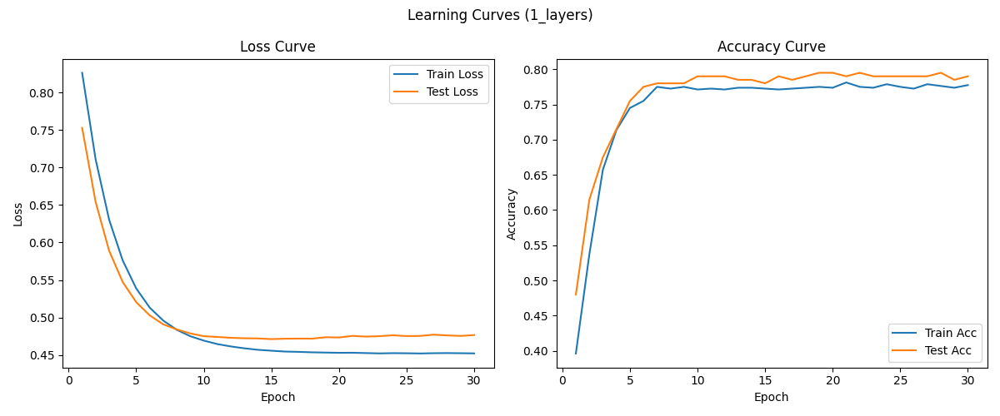

**2 слоя:**
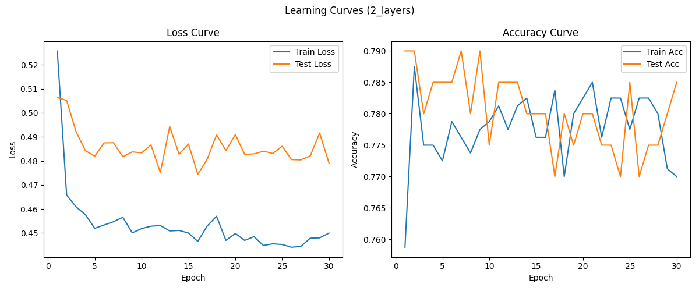

**3 слоя:**
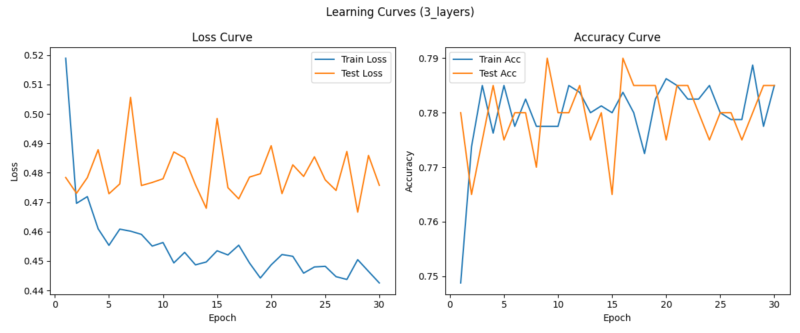

**5 слоев:**
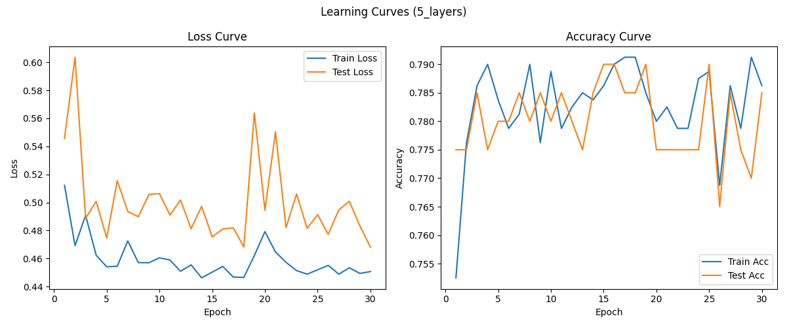

**7 слоев:**
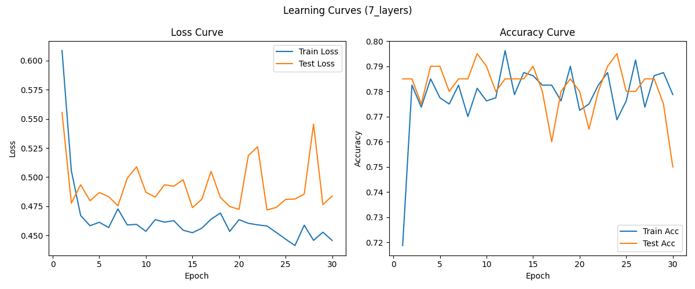

- Проанализируйте время обучения
```
=== Итоговое сравнение точности и времени ===
1_layers: Train Acc=0.7775, Test Acc=0.7900, Time=0.97s
2_layers: Train Acc=0.7700, Test Acc=0.7850, Time=0.95s
3_layers: Train Acc=0.7850, Test Acc=0.7850, Time=0.93s
5_layers: Train Acc=0.7863, Test Acc=0.7850, Time=1.06s
7_layers: Train Acc=0.7788, Test Acc=0.7500, Time=1.24s
```

Время обучения растёт с увеличением числа слоёв (особенно заметно для 5 и 7 слоёв), что ожидаемо: больше параметров — больше вычислений и времени на обратное распространение ошибки.\
Для малых и средних глубин (1–3 слоя) время почти одинаково, но начиная с 5 слоёв рост становится заметным.

## 1.2 Анализ переобучения (15 баллов)
- Исследуйте влияние глубины на переобучение:\
С увеличением глубины сети разрыв между train и test accuracy немного увеличивается (например, для 7 слоёв доходит до 0.029), но всё равно остаётся небольшим.\
Явного переобучения не наблюдается ни для одной конфигурации: нет резкого роста train accuracy при стагнации или падении test accuracy.\
BatchNorm и Dropout дополнительно стабилизируют обучение: для глубоких моделей с ними разрыв даже меньше, чем без них.
- Постройте графики train/test accuracy по эпохам\
**1 слой с BN и DO:**
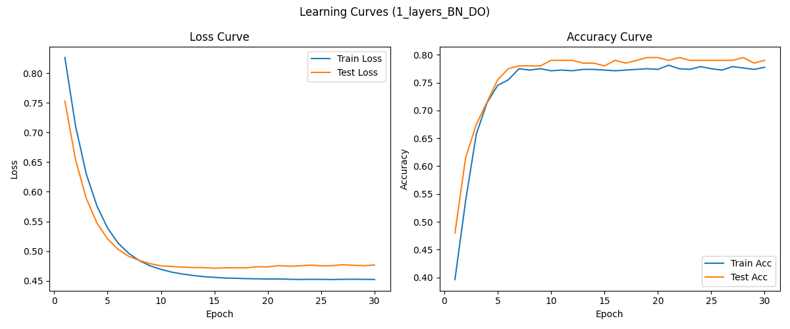

**2 слоя с BN и DO:**
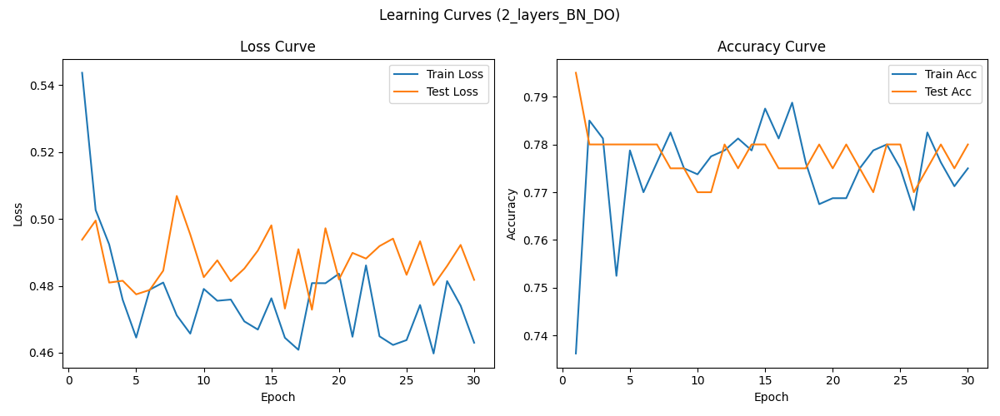

**3 слоя с BN и DO:**
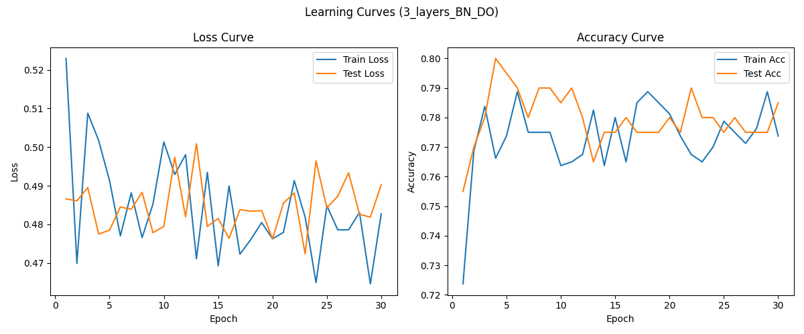

**5 слоев с BN и DO:**
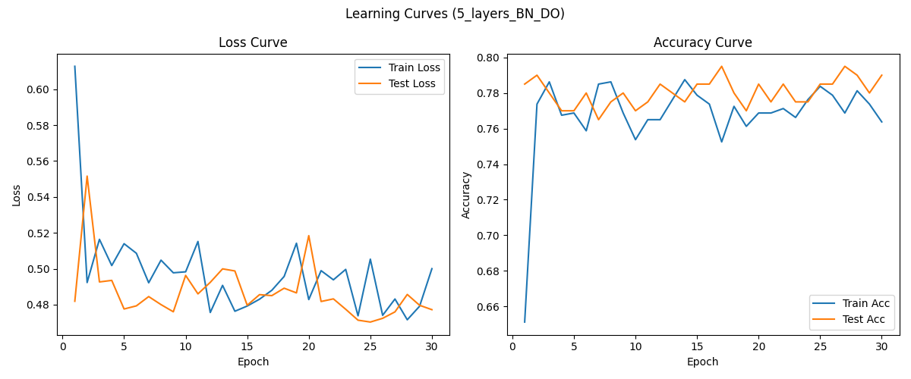

**7 слоев с BN и DO:**
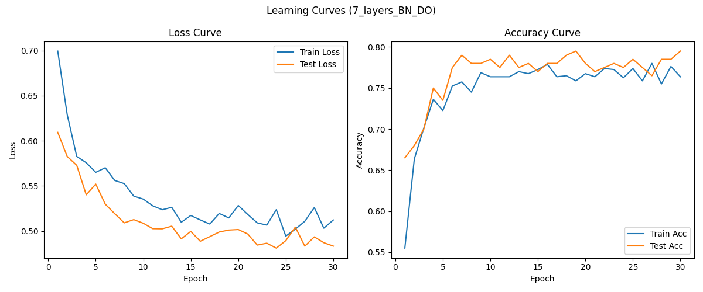
- Определите оптимальную глубину для каждого датасета
```
=== Определение оптимальной глубины (без BN/DO) ===

Оптимальная глубина: слоёв: 3 (модель: 3_layers, test accuracy: 0.7850)

=== Определение оптимальной глубины (с BN и DO) ===

Оптимальная глубина: слоёв: 1 (модель: 1_layers_BN_DO, test accuracy: 0.7900)
```
- Добавьте Dropout и BatchNorm, сравните результаты
```
=== Итоговое сравнение точности и времени для всех моделей ===
1_layers:       Train Acc=0.7775, Test Acc=0.7900, Time=0.79s
1_layers_BN_DO: Train Acc=0.7775, Test Acc=0.7900, Time=0.70s
2_layers:       Train Acc=0.7700, Test Acc=0.7850, Time=0.81s
2_layers_BN_DO: Train Acc=0.7750, Test Acc=0.7800, Time=0.93s
3_layers:       Train Acc=0.7850, Test Acc=0.7850, Time=0.81s
3_layers_BN_DO: Train Acc=0.7738, Test Acc=0.7850, Time=1.04s
5_layers:       Train Acc=0.7863, Test Acc=0.7850, Time=1.00s
5_layers_BN_DO: Train Acc=0.7638, Test Acc=0.7900, Time=1.56s
7_layers:       Train Acc=0.7788, Test Acc=0.7500, Time=1.18s
7_layers_BN_DO: Train Acc=0.7638, Test Acc=0.7950, Time=1.76s
```
- Проанализируйте, когда начинается переобучение
```
1_layers: максимальный разрыв train/test acc = -0.001 на эпохе 4
  Явного переобучения не обнаружено.
2_layers: максимальный разрыв train/test acc = 0.014 на эпохе 17
  Явного переобучения не обнаружено.
3_layers: максимальный разрыв train/test acc = 0.015 на эпохе 15
  Явного переобучения не обнаружено.
5_layers: максимальный разрыв train/test acc = 0.021 на эпохе 29
  Явного переобучения не обнаружено.
7_layers: максимальный разрыв train/test acc = 0.029 на эпохе 30
  Явного переобучения не обнаружено.
1_layers_BN_DO: максимальный разрыв train/test acc = -0.001 на эпохе 4
  Явного переобучения не обнаружено.
2_layers_BN_DO: максимальный разрыв train/test acc = 0.014 на эпохе 17
  Явного переобучения не обнаружено.
3_layers_BN_DO: максимальный разрыв train/test acc = 0.017 на эпохе 13
  Явного переобучения не обнаружено.
5_layers_BN_DO: максимальный разрыв train/test acc = 0.020 на эпохе 7
  Явного переобучения не обнаружено.
7_layers_BN_DO: максимальный разрыв train/test acc = 0.015 на эпохе 27
  Явного переобучения не обнаружено.
```
В экспериментах порог явного переобучения (разрыв > 0.05–0.1) не достигнут ни на одной эпохе.\
Максимальные разрывы наблюдаются на последних эпохах (например, 29–30 эпоха для 5–7 слоёв), но они всё равно малы.\
Это говорит о том, что датасет либо достаточно простой для моделей такой сложности, либо объём данных достаточен, чтобы избежать переобучения даже для глубоких сетей.

# Задание 2: Эксперименты с шириной сети (25 баллов)
## 2.1 Сравнение моделей разной ширины (15 баллов)
Создайте модели с различной шириной слоев:
- Узкие слои: [64, 32, 16]
- Средние слои: [256, 128, 64]
- Широкие слои: [1024, 512, 256]
- Очень широкие слои: [2048, 1024, 512]
Для каждого варианта:
- Поддерживайте одинаковую глубину (3 слоя)\
Выполняется 👍
- Сравните точность и время обучения
```
=== Итоговое сравнение точности, времени и числа параметров ===
widths_64_32_16:      Train Acc=0.7825, Test Acc=0.7850, Time=1.10s, Params=2834
widths_256_128_64:    Train Acc=0.7825, Test Acc=0.7850, Time=1.29s, Params=42050
widths_1024_512_256:  Train Acc=0.7863, Test Acc=0.7900, Time=0.93s, Params=659714
widths_2048_1024_512: Train Acc=0.7688, Test Acc=0.7750, Time=1.07s, Params=2630146
```
Точность на train и test практически одинакова для всех моделей (разница не превышает 1.5%).\
Время обучения не растёт строго с увеличением числа параметров.
- Проанализируйте количество параметров\
Рост числа параметров почти не влияет на качество на этом датасете: test accuracy остаётся на одном уровне или даже слегка падает для самой широкой модели.\
Слишком широкая сеть (2048_1024_512) показывает даже чуть худшую точность на тесте, чем более компактные варианты — это может быть связано с переобучением или с тем, что задача слишком простая для такой модели.
## 2.2 Оптимизация архитектуры (10 баллов)
Найдите оптимальную архитектуру:
- Используйте grid search для поиска лучшей комбинации\
Использовал 👍
- Попробуйте различные схемы изменения ширины (расширение, сужение, постоянная)\
Попробовал 👍
```
2025-07-04 06:59:37,635 [INFO] Оптимальная архитектура: схема=Расширение, ширины слоёв=[16, 40, 64], test accuracy=0.7950
```
- Визуализируйте результаты в виде heatmap\
**Постоянная:**
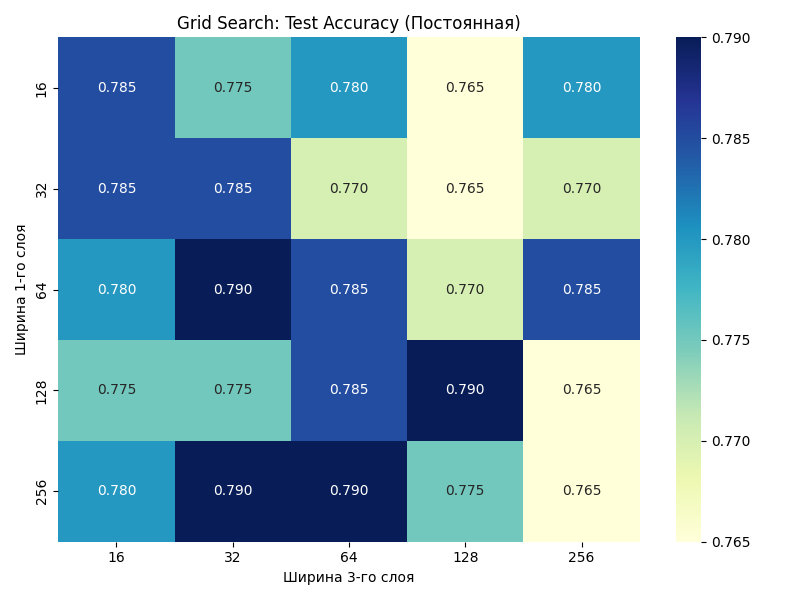

**Расширение:**
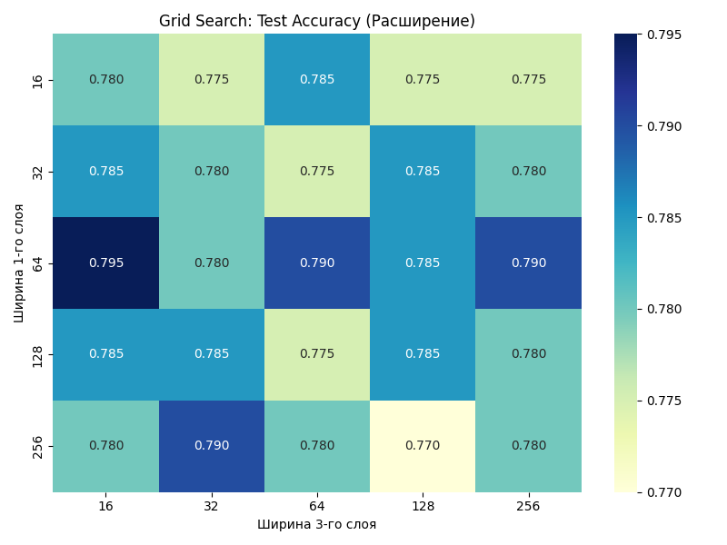

**Сужение:**
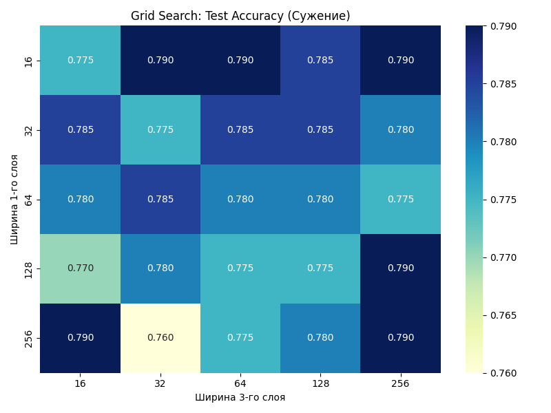

# Задание 3: Эксперименты с регуляризацией (25 баллов)
## 3.1 Сравнение техник регуляризации (15 баллов)
Исследуйте различные техники регуляризации:
- Без регуляризации
- Только Dropout (разные коэффициенты: 0.1, 0.3, 0.5)
- Только BatchNorm
- Dropout + BatchNorm
- L2 регуляризация (weight decay)\
Для каждого варианта:
- Используйте одинаковую архитектуру\
Выполняется 👍
- Сравните финальную точность
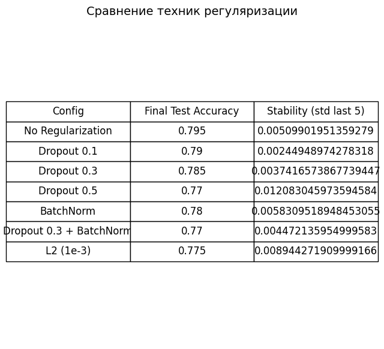\
В данном эксперименте ни одна из техник регуляризации не улучшила итоговую точность по сравнению с отсутствием регуляризации. Это может говорить о том, что модель и/или данные не склонны к сильному переобучению.
- Проанализируйте стабильность обучения
Dropout 0.1–0.3 — лучший компромисс между точностью и стабильностью: почти не уступает по финальной точности, но делает обучение более предсказуемым и устойчивым.\
BatchNorm и L2 в этой задаче не дают выигрыша ни по точности, ни по стабильности.\
Сильная регуляризация (Dropout 0.5, L2) может быть избыточной для данной архитектуры и объёма данных.

Без регуляризации — максимальная точность, но чуть менее устойчивая динамика метрики.
- Визуализируйте распределение весов\
**Без регуляризации:**
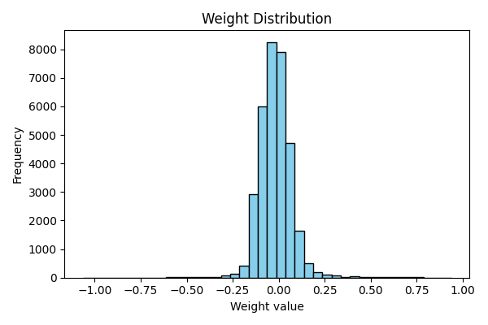

**Dropout 0.1:**
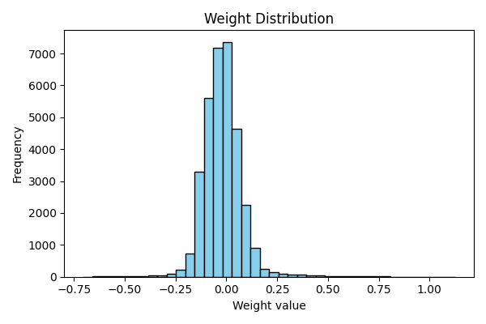

**Dropout 0.3:**
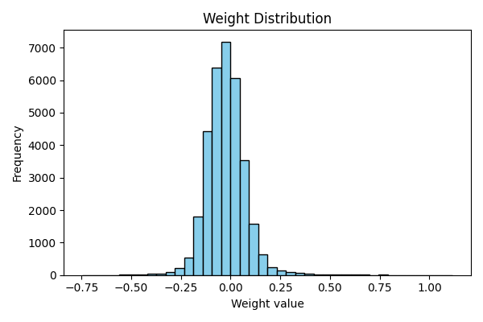

**Dropout 0.5:**
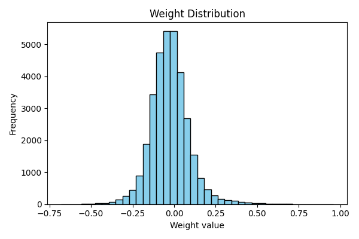

**BathNorm:**
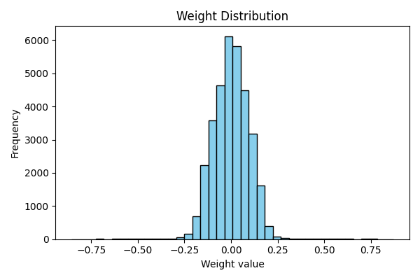

**Dropout 0.3 + BatchNorm:**
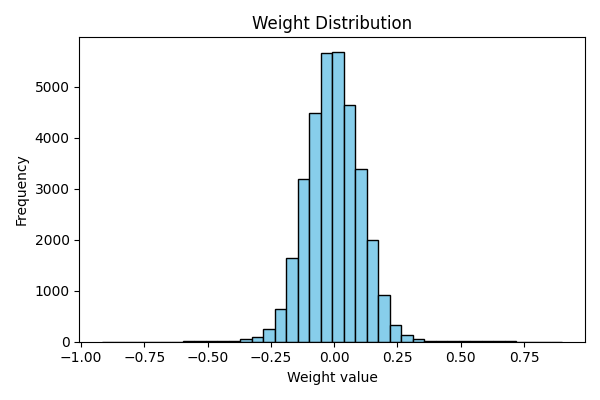

**L2 регуляризация:**
.png)

## 3.2 Адаптивная регуляризация (10 баллов)
Реализуйте адаптивные техники:
- Dropout с изменяющимся коэффициентом\
Реализовал 👍
- BatchNorm с различными momentum\
Реализовал 👍
- Комбинирование нескольких техник\
Реализовал 👍
- Анализ влияния на разные слои сети\
Сравнение техник регуляризации:
```
Config                                          Final Test Accuracy     Stability (std last 5)      
----------------------------------------------------------------------------------------------
Adaptive Dropout (linear decay)                       0.7950                  0.008602
Adaptive Dropout (exp decay)                          0.7900                  0.005099
BatchNorm (momentum 0.05 or 0.1 or 0.2)               0.7900                  0.009695
Adaptive Dropout (linear) + BatchNorm (diff momentum) 0.7800                  0.005099
```
Адаптивный Dropout с линейным уменьшением обеспечивает наилучший баланс между точностью и контролем за переобучением, особенно в глубоких слоях.\
BatchNorm хорошо стабилизирует обучение, но не всегда даёт прирост точности по сравнению с Dropout.\
Комбинация техник не всегда эффективна для простых MLP: может привести к избыточной регуляризации и снижению качества.\
Распределения весов показывают, что все техники успешно предотвращают появление экстремальных значений, но Dropout делает веса более "разреженными", а BatchNorm — более "собранными".
